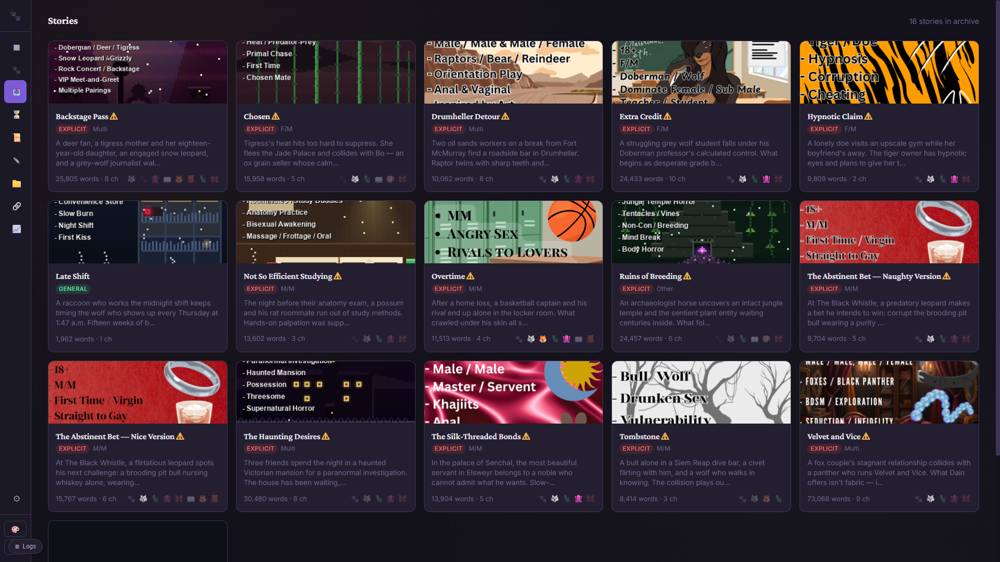
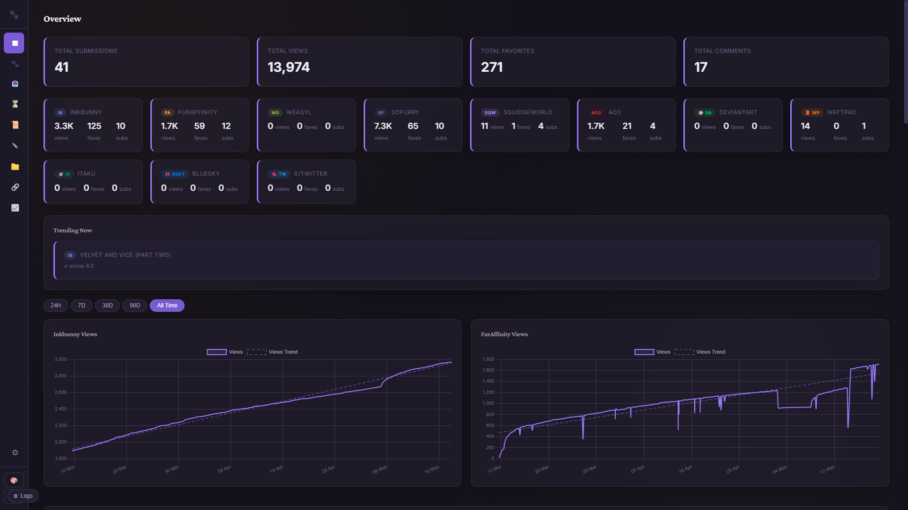
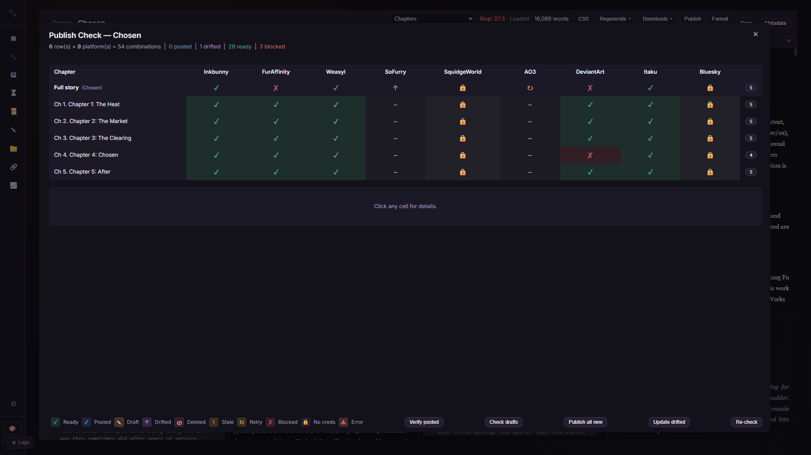
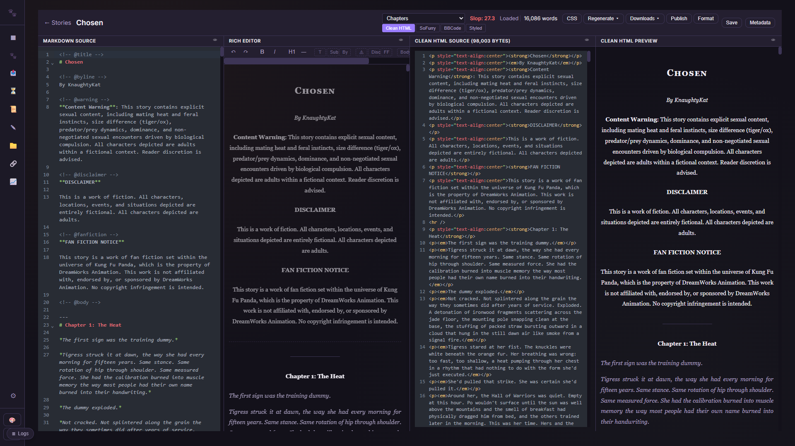

<p align="center">
  
</p>

<h1 align="center">PawPoller</h1>

<p align="center"><strong>Multi-platform story publishing pipeline for furry fiction writers.</strong></p>

<p align="center">🌐 <a href="https://pawpoller.pages.dev"><strong>pawpoller.pages.dev</strong></a> &nbsp;·&nbsp; features, screenshots, download</p>

<p align="center">
  <a href="LICENSE"></a>
  <a href="https://python.org"></a>
  <a href="#quick-start"></a>
  <a href="#server--docker-deployment"></a>
</p>

PawPoller is a desktop app and self-hosted server for publishing fiction across furry writing platforms. Write your stories in Markdown, convert them to every format (BBCode, HTML, Styled HTML, PDF), post to 9 platforms with per-chapter tags and descriptions, and track views, favourites, and comments across 15 from a single dashboard. Think of it as [PostyBirb](https://www.postybirb.com/) but built for writers instead of visual artists -- chaptered posting, format conversion, story analytics, and drift detection.

---

## Features

- **Multi-format conversion** -- Markdown to BBCode (Inkbunny), HTML (SoFurry), Styled HTML (AO3 work skins), PDF, and SquidgeWorld format, all from one source file
- **17-platform tracking** -- Inkbunny, FurAffinity, SoFurry, Weasyl, AO3, DeviantArt, SquidgeWorld, Wattpad, Itaku, Bluesky, X/Twitter, Mastodon, Tumblr, Pixiv, Threads, Instagram, and e621 (posting to 9; the rest are read-only analytics)
- **Chaptered publishing** -- Split multi-chapter stories automatically, with per-chapter tags, descriptions, and thumbnails
- **Analytics dashboard** -- Track views, favourites, comments, and other metrics across all platforms with historical charts
- **Polling engine** -- Automatically fetches stats on a schedule, detects new comments and favourites
- **Telegram notifications** -- Get alerts for milestones, new comments, and goal completions
- **Built-in editor** -- Markdown editor with live preview, slop scoring, and format conversion
- **Tag database** -- 20,000+ tags (8,700+ for stories, 11,900+ for artwork) with per-platform validation and chapter-level tagging
- **Goal tracking** -- Set targets for views/favourites/comments and track progress
- **Two deployment modes** -- Desktop app (Windows .exe) or headless Docker server
- **Credential vault** -- Optional encrypted credential storage with system keyring integration
- **Dashboard auth** -- Session-based login with bcrypt, TOTP 2FA, Cloudflare Turnstile, and API keys

---

## Screenshots

<p align="center">
  <br>
  <em>Story archive: every completed story with cover art, ratings, relationships, and status</em>
</p>

<p align="center">
  <br>
  <em>Analytics across 17 platforms: views, favourites, and comment trends over time</em>
</p>

<p align="center">
  <br>
  <em>Publish-check matrix: every chapter and platform at a glance (posted / drifted / blocked)</em>
</p>

<p align="center">
  <br>
  <em>Four-pane editor: Markdown source, live preview, and every derived format in sync</em>
</p>

---

## Quick Start

Full walkthrough: [**docs/SETUP.md**](docs/SETUP.md) — covers desktop, Docker self-hosting (including reverse proxy / Cloudflare Tunnel for public access), and running from source.

### Option A: Download the release (Desktop)

Native builds for Windows and Linux — pick whatever fits your machine:

**Windows** (two formats):

- **`PawPoller-Setup-{version}.exe`** (recommended): single-file installer.
  Per-user install by default (no UAC prompt); optional Start Menu /
  desktop shortcuts; optional "Run on Windows startup". Comes with a
  proper uninstaller in **Add or Remove Programs** that offers to keep
  your data folder so reinstalls don't wipe your SQLite DB / settings.
- **`PawPoller-windows-x64.zip`**: portable build. Extract and run
  `PawPoller.exe` from anywhere. No installer artefacts on your system.

**Linux** (single file):

- **`PawPoller-{version}-x86_64.AppImage`**: distro-independent single-file
  build. `chmod +x` and double-click (or run from a terminal). Works
  on Ubuntu 22.04+, Fedora 37+, Debian 12+, Arch — anything with
  glibc 2.35 or newer. Optional autostart via the in-app Settings →
  General toggle (writes a `.desktop` file under `~/.config/autostart/`).
- Need desktop notifications? `sudo apt install libnotify-bin` (or
  your distro's equivalent). The AppImage works without it; you just
  won't see toast pop-ups.

**macOS**: not yet — on the roadmap. Run via Docker for now.

After the first launch, the in-app setup wizard guides you through
connecting your platforms.

### Option B: Run from source

```bash
git clone https://github.com/knaughtykat01-prog/PawPoller.git
cd PawPoller
pip install -r requirements.txt
python main.py
```

### Option C: Docker (headless server)

```bash
git clone https://github.com/knaughtykat01-prog/PawPoller.git
cd PawPoller
cp .env.example .env    # Edit with your credentials — set DASHBOARD_PASSWORD!
# Optional: set PAWPOLLER_ARCHIVE_DIR in .env to your story-archive path
docker compose up -d --build
```

The dashboard binds to `127.0.0.1:8420` by default (loopback only), reachable at `http://localhost:8420` on the host. To reach it from other devices, put it behind a reverse proxy — or set `PAWPOLLER_BIND=0.0.0.0` in `.env`, but only with `DASHBOARD_PASSWORD` set. See [docs/SETUP.md §2.5](docs/SETUP.md#25-exposing-it-to-the-web).

---

## Supported Platforms

| Platform | Auth | Poll | Post | Notes |
|----------|------|------|------|-------|
| Inkbunny | Username/password | Yes | Yes | Official API; chaptered stories + art |
| FurAffinity | Session cookies (a/b) | Yes | Yes | Scraping (no official API); posting is desktop-only |
| SoFurry | Email/password | Yes | Yes | Scraping; chaptered |
| Weasyl | API key | Yes | Yes\* | Official API (\*posting in validation) |
| AO3 | Username/password | Yes | Yes | Rails CSRF login; work skins; chaptered |
| SquidgeWorld | Username/password | Yes | Yes | Scraping; work skins; chaptered |
| DeviantArt | OAuth2 (client id/secret) | Yes | Yes | Official API; no proxy needed |
| Itaku | Account token | Yes | Yes\* | Artwork (\*posting in validation) |
| Bluesky | Handle/app password | Yes | Yes | AT Protocol; posts + announcements |
| Wattpad | Public (read-only) | Yes | -- | Public stats only |
| X/Twitter | Auth token/ct0 | Yes | -- | GraphQL scraping; views/likes/reposts |
| Mastodon | Instance URL + access token | Yes | -- | Decentralised; favourites/boosts/replies |
| Tumblr | API key + blog | Yes | -- | v2 API; notes |
| Pixiv | Refresh token | Yes | -- | App API; illustrations + novels |
| Threads | Meta access token | Yes | -- | Official API; needs a Meta app |
| Instagram | Meta access token | Yes | Yes | Official Graph API; Business/Creator account |
| e621 | Username + API key | Yes | -- | Official REST API; tracks your own uploads (score/faves/comments) |

---

## Architecture

PawPoller has two entry points:

- **`main.py`** -- Desktop mode. Runs a pywebview native window with a pystray system tray icon. Per-platform poller threads run in the background. Best for personal use on Windows.
- **`server.py`** -- Headless/server mode. Runs just the FastAPI dashboard and a unified poll orchestrator. Designed for Docker or Linux VPS deployment for 24/7 polling.

Both modes share:
- **`dashboard.py`** -- FastAPI application serving the web UI and API
- **`config.py`** -- Settings, credentials, and path resolution
- **`database/`** -- SQLite database with per-platform schemas
- **`frontend/`** -- Plain HTML/JS/CSS dashboard (no build step, no framework)

Each platform follows a consistent file pattern:
```
clients/{xx}/client.py     -- HTTP client for the platform API
polling/{xx}_poller.py     -- Poll cycle orchestration
database/{xx}_queries.py   -- Database queries
database/{xx}_schema.sql   -- SQL schema
routes/{xx}_api.py         -- Dashboard API endpoints
posting/platforms/{xx}.py  -- Upload/edit logic (where supported)
```

---

## Development

### Prerequisites

- Python 3.11+
- pip

### Setup

```bash
git clone https://github.com/knaughtykat01-prog/PawPoller.git
cd PawPoller
pip install -r requirements.txt
cp .env.example .env          # Optional: for env-based credential config
python main.py                # Desktop mode
# or
python server.py              # Headless mode
```

### Server-only dependencies

For Docker/server deployments, use the pinned server requirements:

```bash
pip install -r requirements-server.txt
```

### Building the Windows executable

```bash
pip install pyinstaller
python -m PyInstaller pawpoller.spec --noconfirm
# Output: dist/PawPoller/PawPoller.exe
```

### Running tests

```bash
python -m pytest tests/ -v
```

### Project documentation

[`docs/SETUP.md`](docs/SETUP.md) covers install and architecture. The source is heavily commented — start with `dashboard.py`, then a platform under `clients/{xx}/` with its `polling/{xx}_poller.py`. See [CONTRIBUTING.md](CONTRIBUTING.md) for the per-platform file pattern.

---

## Security

PawPoller holds your login credentials for up to 17 platforms, so credential handling is
treated as the core of the app: secrets are **always** stored in an encrypted vault
(AES-128 + HMAC via Fernet), never in plaintext, with the key held in your OS keystore or an
out-of-band env var on a server ([SETUP §5.1](docs/SETUP.md)).

The app is assessed against the **[OWASP ASVS 5.0](https://owasp.org/www-project-application-security-verification-standard/) Level 2** standard.
The full self-assessment — all 253 L1/L2 requirements adjudicated with evidence, plus an
honest register of known gaps — is published at
**[`docs/security/ASVS_ASSESSMENT.md`](docs/security/ASVS_ASSESSMENT.md)**. It's a
self-assessment (not third-party certified), maintained as a baseline for future changes.

Found a vulnerability? Please open a private security advisory on the GitHub repository rather
than a public issue.

---

## Contributing

See [CONTRIBUTING.md](CONTRIBUTING.md) for guidelines on development setup, adding new platforms, code style, and pull requests.

---

## License

[MIT](LICENSE)

---

## Credits

- Inspired by [PostyBirb](https://www.postybirb.com/) -- PawPoller takes the multi-platform publishing concept and rebuilds it for fiction writers with chaptered stories, format conversion, and analytics
- Built with [FastAPI](https://fastapi.tiangolo.com/), [pywebview](https://pywebview.flowrl.com/), [Chart.js](https://www.chartjs.org/)
